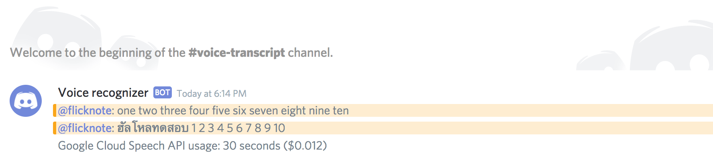

# Discord transcriber bot

This bot listens to utterances in a specified voice channel, sends them to
Google Cloud Speech-To-Text API (which supports
[more than 100 languages and dialects](https://cloud.google.com/speech-to-text/docs/languages)),
and posts the transcription into a text channel.

Thanks to Discord, each user gets their own voice stream, which means this bot
can figure out who said what.

Transcription [costs $0.006](https://cloud.google.com/speech-to-text/pricing)
for each message shorter than 15 seconds.



## Configuration

Create these files:

### `discord.config.json`

```js
{
  "token": "________________________.______.___________________________",
  "guildId": "__________________",
  "voiceChannelName": "voice",
  "textChannelName": "voice-transcript",
  "languageCode": "en_US"
}
```

### `google-cloud.credentials.json`

Put your service account’s JSON credentials here.

## Running locally

Node.js required.

```sh
# Install dependencies
yarn

# Run the bot
yarn start
```

## Running on a server with Docker

```sh
# Build a Docker image
docker build -t discord-transcriber .

# Create a folder to hold config
mkdir -p /etc/discord-transcriber

# Put configuration files there
cat > /etc/discord-transcriber/discord.config.json # Paste
cat > /etc/discord-transcriber/google-cloud.credentials.json # Paste

# Run the container
docker run -d \
  -v /etc/discord-transcriber/discord.config.json:/usr/src/app/discord.config.json \
  -v /etc/discord-transcriber/google-cloud.credentials.json:/usr/src/app/google-cloud.credentials.json \
  --restart=always \
  --name=discord-transcriber \
  discord-transcriber

# View logs
docker logs discord-transcriber
```
